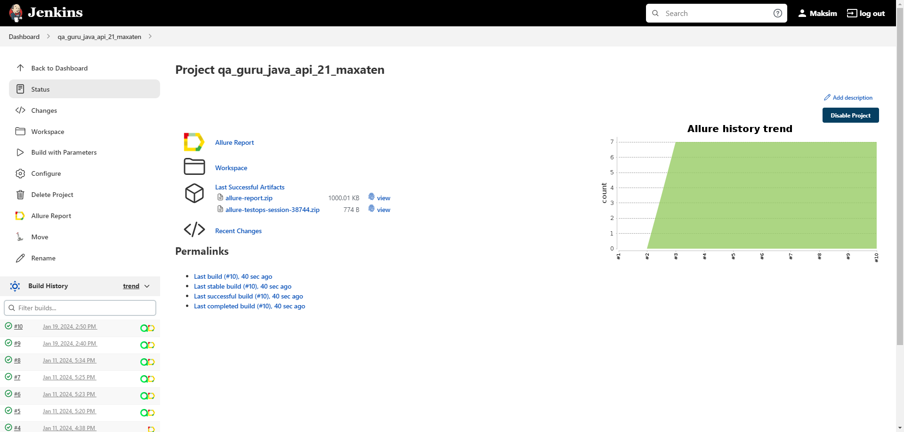
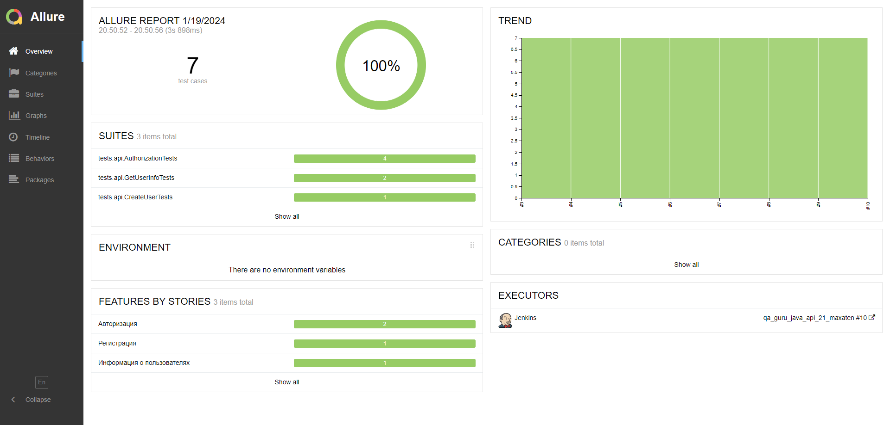
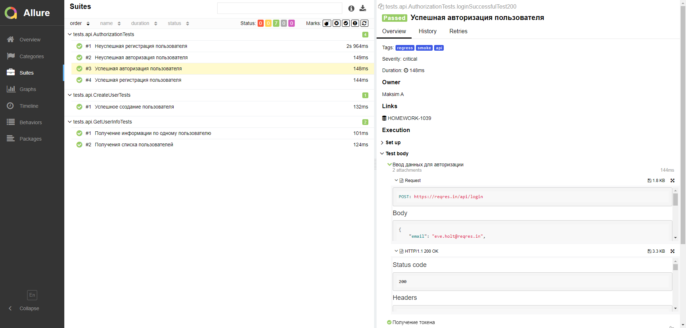
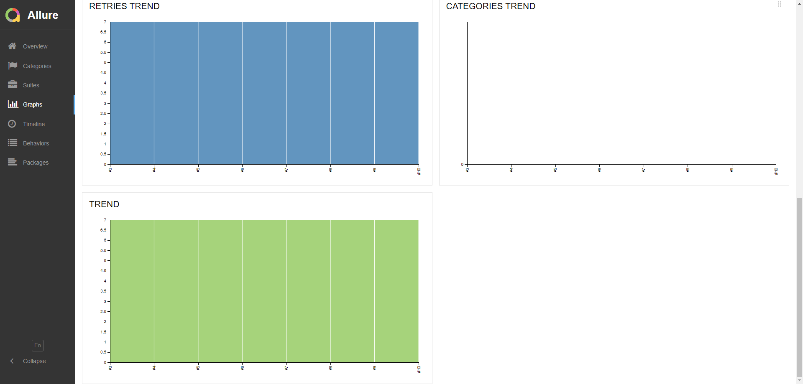
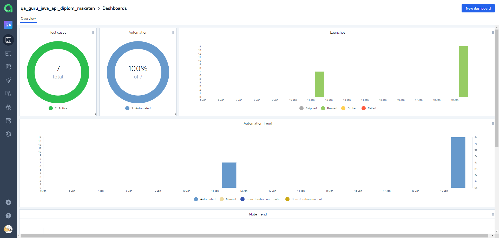
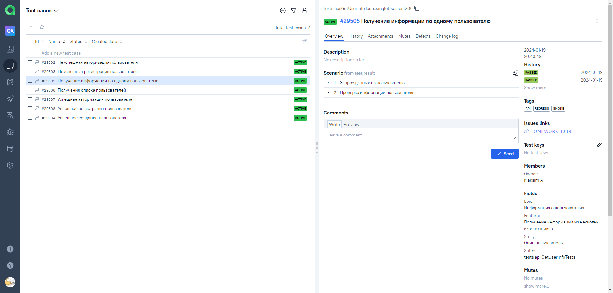
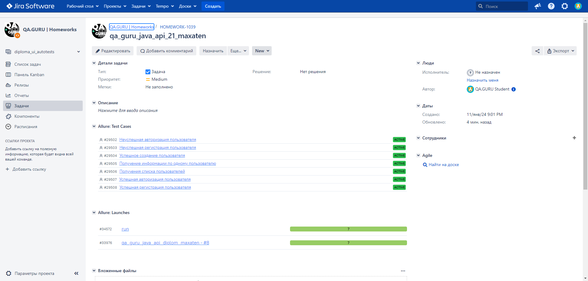

# Демо проект по автоматизации тестирования сайта API на сайте [**reqres.in**](https://reqres.in/)

---

## **Содержание**:

---

* <a href="#tools">Технологии и инструменты</a>

* <a href="#cases">Примеры автоматизированных тест-кейсов</a>

* <a href="#jenkins">Сборка в Jenkins</a>

* <a href="#console">Запуск из терминала</a>

* <a href="#allure">Allure отчет</a>

* <a href="#allure-testops">Интеграция с Allure TestOps</a>

* <a href="#jira">Интеграция с Jira</a>

* <a href="#telegram">Уведомление в Telegram при помощи бота</a>

---

<a id="tools"></a>
## <a name="Технологии и инструменты">**Технологии и инструменты:**</a>

<p align="center">  
<a href="https://www.jetbrains.com/idea/"></a>  
<a href="https://www.java.com/"></a>  
<a href="https://github.com/"></a>  
<a href="https://junit.org/junit5/"></a>  
<a href="https://gradle.org/"></a>  
<a href="https://selenide.org/"></a>  
<a href="https://selenide.org/"></a>  
<a href="ht[images](images)tps://github.com/allure-framework/allure2"></a> 
<a href="https://qameta.io/"></a>   
<a href="https://www.jenkins.io/"></a>  
<a href="https://www.atlassian.com/ru/software/jira/"></a>
<a href="https://core.telegram.org/bots/api/"></a> 
</p>

---
<a id="cases"></a>
## <a name="Примеры автоматизированных тест-кейсов">**Примеры автоматизированных тест-кейсов:**</a>

- *Получение информации по одному пользователю*
- *Успешная регистрация пользователя*
- *Неуспешная регистрация пользователя*
- *Успешная авторизация пользователя*
- *Неуспешная авторизация пользователя*
- *Успешное создание пользователя*
- *Получения списка пользователей*
- *Проверка данных о первом первого пользователя*

---
<a id="jenkins"></a>
## </a><a name="Сборка"></a>Сборка в [Jenkins](https://jenkins.autotests.cloud/job/qa_guru_java_api_diplom_maxaten/)</a>


<p align="center">  
<a href="https://jenkins.autotests.cloud/job/Project%20qa_guru_java_lesson_17_mag_maxaten/"></a>  
</p>

---
<a id="console"></a>
## Команды для запуска из терминала


***Локальный запуск:***
```bash  
./gradlew clean api_test allureServ
```

---
<a id="allure"></a>
## </a> <a name="Allure"></a>Отчет [Allure](https://jenkins.autotests.cloud/job/qa_guru_java_api_diplom_maxaten/allure/#)</a>

### *Основная страница отчёта*

<p align="center">  
  
</p>

### *Тест-кейсы*

<p align="center">  
  
</p>

### *Графики*

  <p align="center">  


  
</p>

___
<a id="allure-testops"></a>
## </a>Интеграция с [Allure TestOps](https://allure.autotests.cloud/project/3948/dashboards)</a>

### *Allure TestOps Dashboard*

<p align="center">  
  
</p>  


### *Авто тест-кейсы*

<p align="center">  
  
</p>

___
<a id="jira"></a>
## </a> Интеграция с [Jira](https://jira.autotests.cloud/browse/HOMEWORK-1039)</a>


<p align="center">  
  
</p>

___
<a id="telegram"></a>
## </a> Уведомление в Telegram при помощи бота

<p align="center">  
  
</p>
